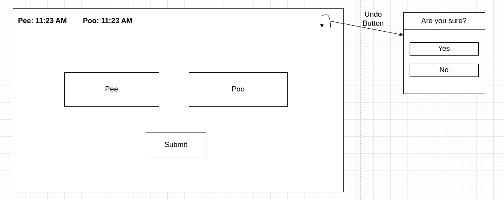

# BobaTrackerAngular

## Introduction

The purpose of this project is to develop a front end for [Boba Tracker API](https://github.com/null-coder13/Boba-Tracker). This projects main goal is to provide a way to track when my dog was last let outside to do his business. Ultimately this project will be displayed on a Raspberry Pi 4 using a 5 inch display. 

This project was generated with [Angular CLI](https://github.com/angular/angular-cli) version 15.0.3.

## UI Design

The goal of the UI is to be as simple as possible by being able to submit an entry in at most three clicks.

## Deployment
Deploy the application to a Raspberry Pi 4 with the following steps.

1. Build the angular application with `ng build`.
2. Install Node.js on the Raspberry Pi.
3. Install http-server with npm `sudo npm i -g http-server`.
4. Transfer build files or clone this repo to the Raspberry pi (note you will need to repeat step 1 if you clone).
5. Serve the build files with http-server `http-server <path to build files>`.

## Development server

Run `ng serve` for a dev server. Navigate to `http://localhost:4200/`. The application will automatically reload if you change any of the source files.

## Code scaffolding

Run `ng generate component component-name` to generate a new component. You can also use `ng generate directive|pipe|service|class|guard|interface|enum|module`.

## Build

Run `ng build` to build the project. The build artifacts will be stored in the `dist/` directory.

## Running unit tests

Run `ng test` to execute the unit tests via [Karma](https://karma-runner.github.io).

## Running end-to-end tests

Run `ng e2e` to execute the end-to-end tests via a platform of your choice. To use this command, you need to first add a package that implements end-to-end testing capabilities.

## Further help

To get more help on the Angular CLI use `ng help` or go check out the [Angular CLI Overview and Command Reference](https://angular.io/cli) page.
